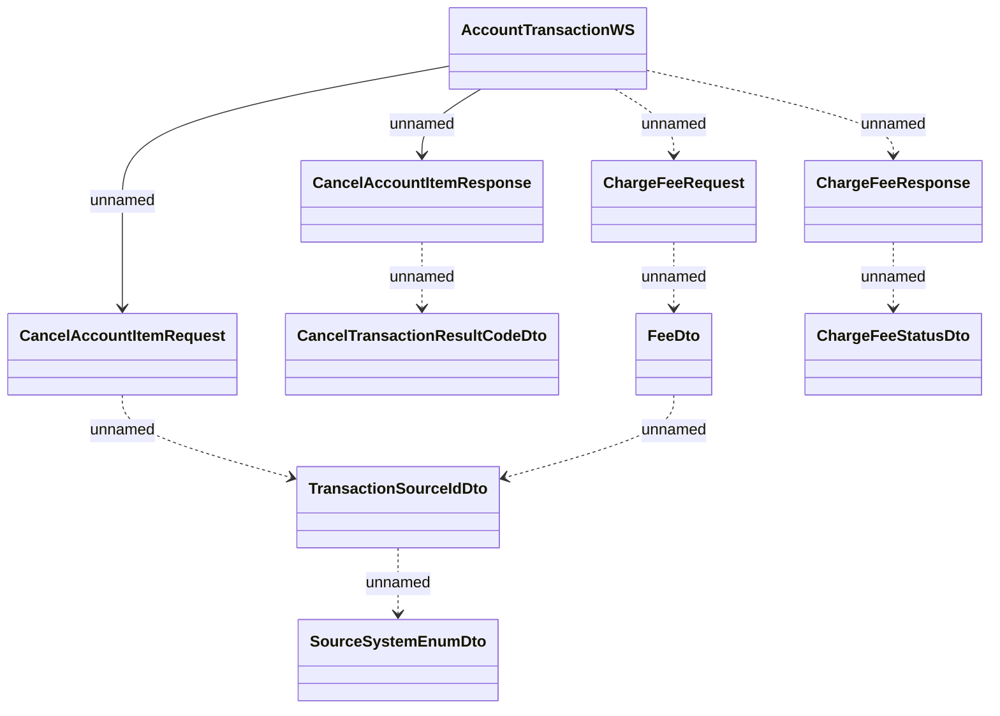

# Account TransactionsWS - charge/cancel fee

- **Diagram Type**: Logical
- **Package**: HomerSelect/BSL/Analysis Model/_Interface/Consumed services/Payment Card system/Account/Account Transactions
- **Diagram ID**: 149533
- **Elements**: 10
- **Connectors**: 10

