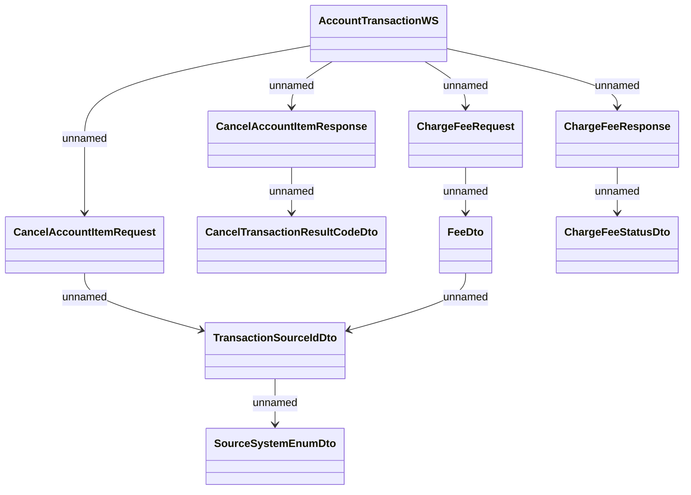

# Account TransactionsWS - charge/cancel fee

```mermaid
classDiagram
    class CancelAccountItemResponse["CancelAccountItemResponse"]
    class CancelAccountItemRequest["CancelAccountItemRequest"]
    class CancelTransactionResultCodeDto["CancelTransactionResultCodeDto"]
    class FeeDto["FeeDto"]
    class TransactionSourceIdDto["TransactionSourceIdDto"]
    class SourceSystemEnumDto["SourceSystemEnumDto"]
    class ChargeFeeStatusDto["ChargeFeeStatusDto"]
    class ChargeFeeResponse["ChargeFeeResponse"]
    class ChargeFeeRequest["ChargeFeeRequest"]
    class AccountTransactionWS["AccountTransactionWS"]
    AccountTransactionWS --> CancelAccountItemRequest : unnamed
    AccountTransactionWS --> ChargeFeeResponse : unnamed
    AccountTransactionWS --> ChargeFeeRequest : unnamed
    AccountTransactionWS --> CancelAccountItemResponse : unnamed
    ChargeFeeRequest --> FeeDto : unnamed
    ChargeFeeResponse --> ChargeFeeStatusDto : unnamed
    TransactionSourceIdDto --> SourceSystemEnumDto : unnamed
    CancelAccountItemRequest --> TransactionSourceIdDto : unnamed
    CancelAccountItemResponse --> CancelTransactionResultCodeDto : unnamed
    FeeDto --> TransactionSourceIdDto : unnamed
```
