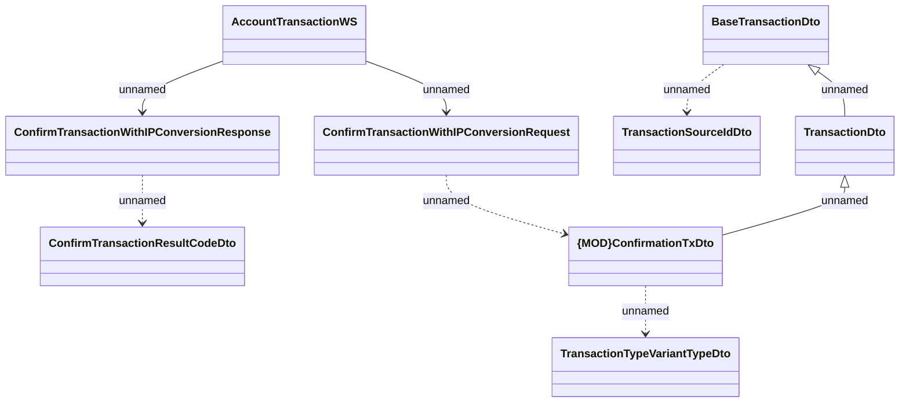

# Account TransactionsWS - usage on REL transaction confirmation and IP conversion

- **Diagram Type**: Logical
- **Package**: HomerSelect/BSL/Analysis Model/_Interface/Consumed services/Payment Card system/Account/Account Transactions
- **Diagram ID**: 149535
- **Elements**: 10
- **Connectors**: 8

