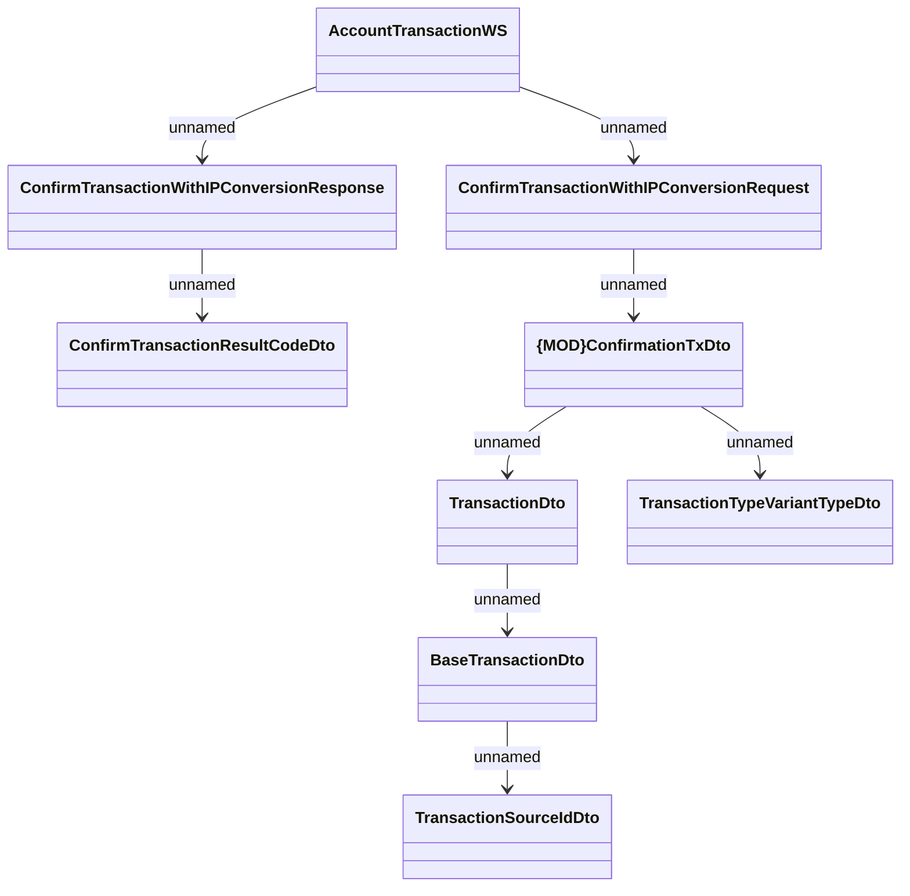

# Account TransactionsWS - usage on REL transaction confirmation and IP conversion

```mermaid
classDiagram
    class TransactionDto["TransactionDto"]
    class BaseTransactionDto["BaseTransactionDto"]
    class TransactionSourceIdDto["TransactionSourceIdDto"]
    class ConfirmTransactionResultCodeDto["ConfirmTransactionResultCodeDto"]
    class TransactionTypeVariantTypeDto["TransactionTypeVariantTypeDto"]
    class MOD_ConfirmationTxDto["{MOD}ConfirmationTxDto"]
    class ConfirmTransactionWithIPConversionResponse["ConfirmTransactionWithIPConversionResponse"]
    class ConfirmTransactionWithIPConversionRequest["ConfirmTransactionWithIPConversionRequest"]
    class AccountTransactionWS["AccountTransactionWS"]
    AccountTransactionWS --> ConfirmTransactionWithIPConversionRequest : unnamed
    AccountTransactionWS --> ConfirmTransactionWithIPConversionResponse : unnamed
    ConfirmTransactionWithIPConversionRequest --> MOD_ConfirmationTxDto : unnamed
    ConfirmTransactionWithIPConversionResponse --> ConfirmTransactionResultCodeDto : unnamed
    MOD_ConfirmationTxDto --> TransactionDto : unnamed
    MOD_ConfirmationTxDto --> TransactionTypeVariantTypeDto : unnamed
    TransactionDto --> BaseTransactionDto : unnamed
    BaseTransactionDto --> TransactionSourceIdDto : unnamed
```
