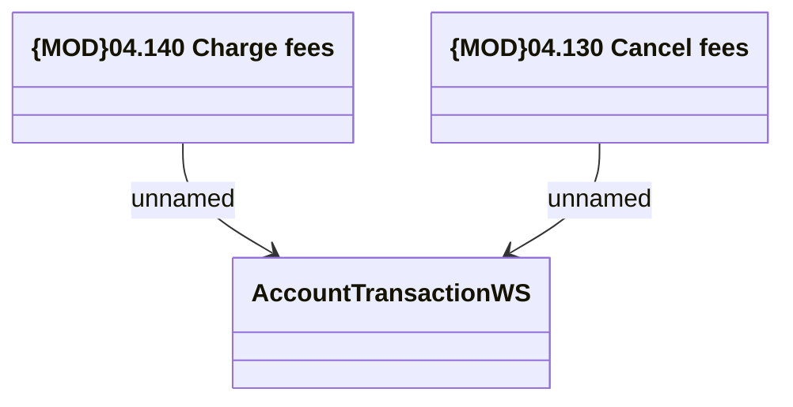

# AccountTransactionWS - fee services

```mermaid
classDiagram
    class AccountTransactionWS["AccountTransactionWS"]
    class MOD_04_140_Charge_fees["{MOD}04.140 Charge fees"]
    class MOD_04_130_Cancel_fees["{MOD}04.130 Cancel fees"]
    MOD_04_140_Charge_fees --> AccountTransactionWS : unnamed
    MOD_04_130_Cancel_fees --> AccountTransactionWS : unnamed
```
