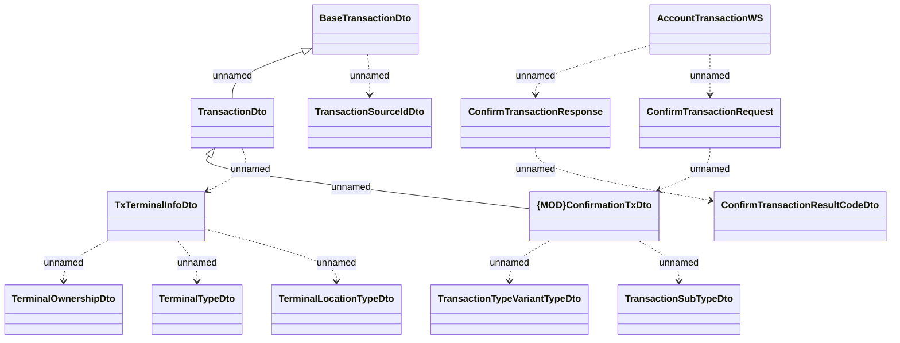

# AccountTransactionWS - usage on REL transaction confirmation

- **Diagram Type**: Logical
- **Package**: HomerSelect/BSL/Analysis Model/_Interface/Consumed services/Payment Card system/Account/Account Transactions
- **Diagram ID**: 149529
- **Elements**: 14
- **Connectors**: 13

