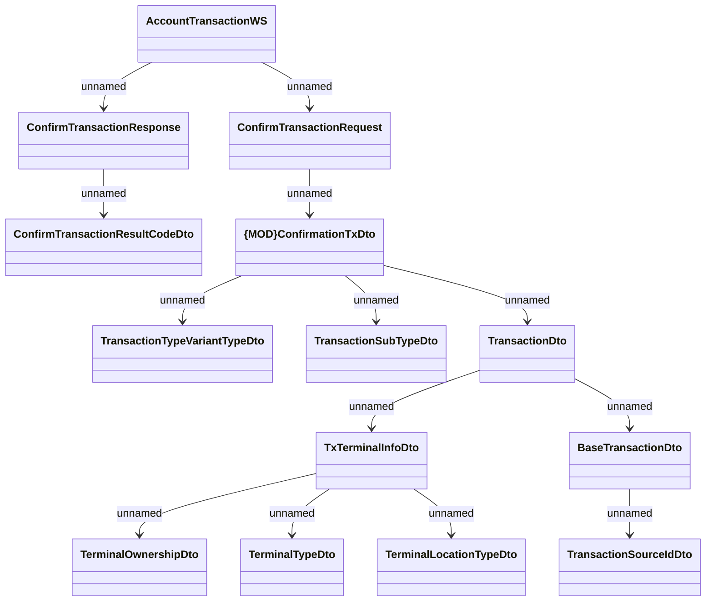

# AccountTransactionWS - usage on REL transaction confirmation

```mermaid
classDiagram
    class TransactionTypeVariantTypeDto["TransactionTypeVariantTypeDto"]
    class TransactionSubTypeDto["TransactionSubTypeDto"]
    class TerminalTypeDto["TerminalTypeDto"]
    class TerminalOwnershipDto["TerminalOwnershipDto"]
    class TerminalLocationTypeDto["TerminalLocationTypeDto"]
    class TxTerminalInfoDto["TxTerminalInfoDto"]
    class ConfirmTransactionResultCodeDto["ConfirmTransactionResultCodeDto"]
    class MOD_ConfirmationTxDto["{MOD}ConfirmationTxDto"]
    class TransactionDto["TransactionDto"]
    class BaseTransactionDto["BaseTransactionDto"]
    class TransactionSourceIdDto["TransactionSourceIdDto"]
    class ConfirmTransactionResponse["ConfirmTransactionResponse"]
    class ConfirmTransactionRequest["ConfirmTransactionRequest"]
    class AccountTransactionWS["AccountTransactionWS"]
    AccountTransactionWS --> ConfirmTransactionResponse : unnamed
    AccountTransactionWS --> ConfirmTransactionRequest : unnamed
    ConfirmTransactionRequest --> MOD_ConfirmationTxDto : unnamed
    ConfirmTransactionResponse --> ConfirmTransactionResultCodeDto : unnamed
    MOD_ConfirmationTxDto --> TransactionDto : unnamed
    MOD_ConfirmationTxDto --> TransactionTypeVariantTypeDto : unnamed
    MOD_ConfirmationTxDto --> TransactionSubTypeDto : unnamed
    TransactionDto --> TxTerminalInfoDto : unnamed
    TxTerminalInfoDto --> TerminalOwnershipDto : unnamed
    TxTerminalInfoDto --> TerminalTypeDto : unnamed
    TxTerminalInfoDto --> TerminalLocationTypeDto : unnamed
    TransactionDto --> BaseTransactionDto : unnamed
    BaseTransactionDto --> TransactionSourceIdDto : unnamed
```
