# AccountTransactionWS

- **Diagram Type**: Logical
- **Package**: HomerSelect/BSL/Analysis Model/_Interface/Consumed services/Payment Card system/Account/Account Transactions
- **Diagram ID**: 149528
- **Elements**: 18
- **Connectors**: 17

```mermaid
classDiagram
    class CancelAuthorizationResponse["CancelAuthorizationResponse"]
    class CancelAuthorizationRequest["CancelAuthorizationRequest"]
    class CancelEventResponse["CancelEventResponse"]
    class CancelEventRequest["CancelEventRequest"]
    class ChargeFeeResponse["ChargeFeeResponse"]
    class ChargeFeeRequest["ChargeFeeRequest"]
    class PairPaymentResponse["PairPaymentResponse"]
    class UnpairPaymentResponse["UnpairPaymentResponse"]
    class UnpairPaymentRequest["UnpairPaymentRequest"]
    class PairPaymentRequest["PairPaymentRequest"]
    class UnpairPaymentBatchResponse["UnpairPaymentBatchResponse"]
    class UnpairPaymentBatchRequest["UnpairPaymentBatchRequest"]
    class PairPaymentBatchRequest["PairPaymentBatchRequest"]
    class ConfirmTransactionResponse["ConfirmTransactionResponse"]
    class ConfirmTransactionRequest["ConfirmTransactionRequest"]
    class AuthorizeTransactionResponse["AuthorizeTransactionResponse"]
    class AuthorizeTransactionRequest["AuthorizeTransactionRequest"]
    class AccountTransactionWS["AccountTransactionWS"]
    AccountTransactionWS ..> AuthorizeTransactionResponse : unnamed
    AccountTransactionWS ..> UnpairPaymentResponse : unnamed
    AccountTransactionWS ..> ChargeFeeRequest : unnamed
    AccountTransactionWS ..> ConfirmTransactionRequest : unnamed
    AccountTransactionWS ..> ChargeFeeResponse : unnamed
    AccountTransactionWS ..> PairPaymentResponse : unnamed
    AccountTransactionWS ..> CancelAuthorizationResponse : unnamed
    AccountTransactionWS ..> UnpairPaymentBatchResponse : unnamed
    AccountTransactionWS ..> UnpairPaymentRequest : unnamed
    AccountTransactionWS ..> PairPaymentBatchRequest : unnamed
    AccountTransactionWS ..> AuthorizeTransactionRequest : unnamed
    AccountTransactionWS ..> CancelEventRequest : unnamed
    AccountTransactionWS ..> UnpairPaymentBatchRequest : unnamed
    AccountTransactionWS ..> PairPaymentRequest : unnamed
    AccountTransactionWS ..> CancelAuthorizationRequest : unnamed
    AccountTransactionWS ..> ConfirmTransactionResponse : unnamed
    AccountTransactionWS ..> CancelEventResponse : unnamed
```

