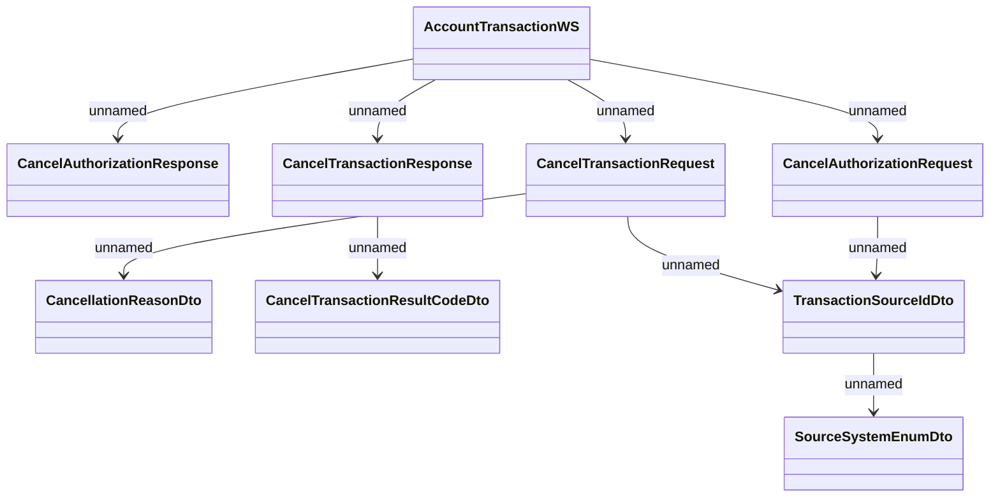

# AccountTransactions - usage at transaction cancellation

```mermaid
classDiagram
    class CancelAuthorizationResponse["CancelAuthorizationResponse"]
    class CancelAuthorizationRequest["CancelAuthorizationRequest"]
    class SourceSystemEnumDto["SourceSystemEnumDto"]
    class CancellationReasonDto["CancellationReasonDto"]
    class CancelTransactionResultCodeDto["CancelTransactionResultCodeDto"]
    class CancelTransactionResponse["CancelTransactionResponse"]
    class CancelTransactionRequest["CancelTransactionRequest"]
    class TransactionSourceIdDto["TransactionSourceIdDto"]
    class AccountTransactionWS["AccountTransactionWS"]
    AccountTransactionWS --> CancelAuthorizationRequest : unnamed
    AccountTransactionWS --> CancelTransactionRequest : unnamed
    AccountTransactionWS --> CancelAuthorizationResponse : unnamed
    AccountTransactionWS --> CancelTransactionResponse : unnamed
    TransactionSourceIdDto --> SourceSystemEnumDto : unnamed
    CancelTransactionRequest --> CancellationReasonDto : unnamed
    CancelTransactionRequest --> TransactionSourceIdDto : unnamed
    CancelTransactionResponse --> CancelTransactionResultCodeDto : unnamed
    CancelAuthorizationRequest --> TransactionSourceIdDto : unnamed
```
