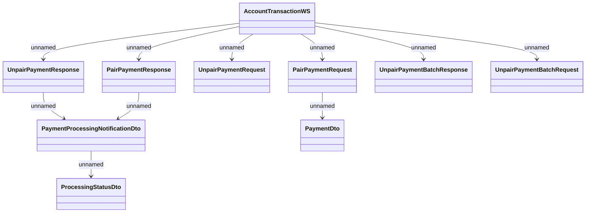

# AccountTransactionsWS - usage in incoming payment management

```mermaid
classDiagram
    class ProcessingStatusDto["ProcessingStatusDto"]
    class PaymentProcessingNotificationDto["PaymentProcessingNotificationDto"]
    class PairPaymentResponse["PairPaymentResponse"]
    class UnpairPaymentResponse["UnpairPaymentResponse"]
    class UnpairPaymentRequest["UnpairPaymentRequest"]
    class PairPaymentRequest["PairPaymentRequest"]
    class PaymentDto["PaymentDto"]
    class UnpairPaymentBatchResponse["UnpairPaymentBatchResponse"]
    class UnpairPaymentBatchRequest["UnpairPaymentBatchRequest"]
    class AccountTransactionWS["AccountTransactionWS"]
    AccountTransactionWS --> PairPaymentRequest : unnamed
    AccountTransactionWS --> UnpairPaymentBatchRequest : unnamed
    AccountTransactionWS --> UnpairPaymentRequest : unnamed
    AccountTransactionWS --> PairPaymentResponse : unnamed
    AccountTransactionWS --> UnpairPaymentResponse : unnamed
    AccountTransactionWS --> UnpairPaymentBatchResponse : unnamed
    PairPaymentRequest --> PaymentDto : unnamed
    UnpairPaymentResponse --> PaymentProcessingNotificationDto : unnamed
    PairPaymentResponse --> PaymentProcessingNotificationDto : unnamed
    PaymentProcessingNotificationDto --> ProcessingStatusDto : unnamed
```
