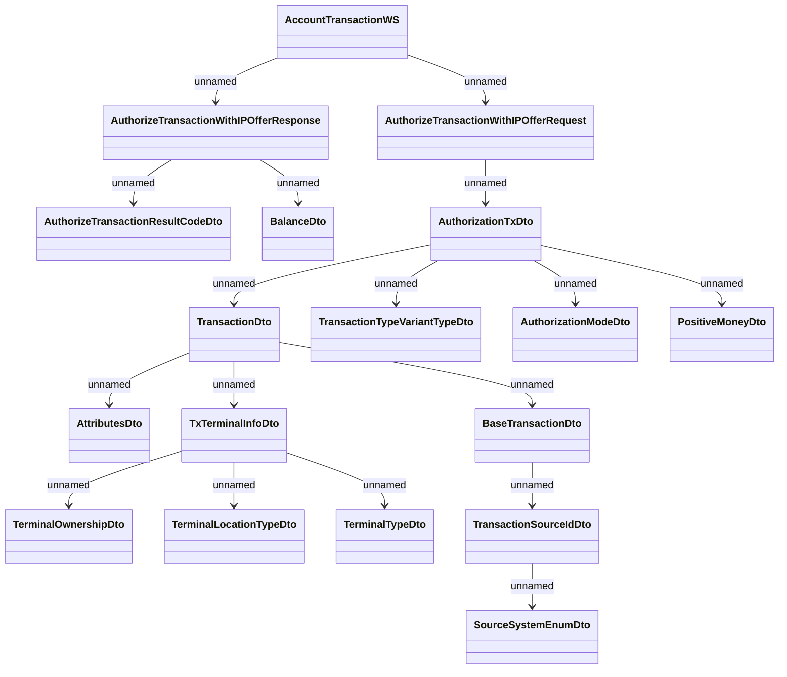

# AuthorizeTransactionWithIPVariant

```mermaid
classDiagram
    class AuthorizeTransactionWithIPOfferResponse["AuthorizeTransactionWithIPOfferResponse"]
    class TransactionDto["TransactionDto"]
    class SourceSystemEnumDto["SourceSystemEnumDto"]
    class TransactionTypeVariantTypeDto["TransactionTypeVariantTypeDto"]
    class TerminalOwnershipDto["TerminalOwnershipDto"]
    class TerminalLocationTypeDto["TerminalLocationTypeDto"]
    class TerminalTypeDto["TerminalTypeDto"]
    class TransactionSourceIdDto["TransactionSourceIdDto"]
    class AttributesDto["AttributesDto"]
    class AuthorizeTransactionResultCodeDto["AuthorizeTransactionResultCodeDto"]
    class BalanceDto["BalanceDto"]
    class AuthorizationModeDto["AuthorizationModeDto"]
    class PositiveMoneyDto["PositiveMoneyDto"]
    class TxTerminalInfoDto["TxTerminalInfoDto"]
    class AccountTransactionWS["AccountTransactionWS"]
    class BaseTransactionDto["BaseTransactionDto"]
    class AuthorizationTxDto["AuthorizationTxDto"]
    class AuthorizeTransactionWithIPOfferRequest["AuthorizeTransactionWithIPOfferRequest"]
    AccountTransactionWS --> AuthorizeTransactionWithIPOfferResponse : unnamed
    AuthorizeTransactionWithIPOfferResponse --> AuthorizeTransactionResultCodeDto : unnamed
    TransactionSourceIdDto --> SourceSystemEnumDto : unnamed
    AuthorizeTransactionWithIPOfferResponse --> BalanceDto : unnamed
    AuthorizeTransactionWithIPOfferRequest --> AuthorizationTxDto : unnamed
    AccountTransactionWS --> AuthorizeTransactionWithIPOfferRequest : unnamed
    AuthorizationTxDto --> TransactionDto : unnamed
    AuthorizationTxDto --> AuthorizationModeDto : unnamed
    AuthorizationTxDto --> TransactionTypeVariantTypeDto : unnamed
    AuthorizationTxDto --> PositiveMoneyDto : unnamed
    TransactionDto --> TxTerminalInfoDto : unnamed
    TxTerminalInfoDto --> TerminalOwnershipDto : unnamed
    TxTerminalInfoDto --> TerminalTypeDto : unnamed
    TxTerminalInfoDto --> TerminalLocationTypeDto : unnamed
    TransactionDto --> BaseTransactionDto : unnamed
    TransactionDto --> AttributesDto : unnamed
    BaseTransactionDto --> TransactionSourceIdDto : unnamed
```
