# Messages

- **Diagram Type**: Logical
- **Package**: HomerSelect/BSL/Analysis Model/_Interface/Consumed services/Payment Card system/Account/Account Transactions/Messages
- **Diagram ID**: 114840
- **Elements**: 24
- **Connectors**: 5

```mermaid
classDiagram
    class CancelEventResponse["CancelEventResponse"]
    class CancelEventRequest["CancelEventRequest"]
    class CancelAccountItemResponse["CancelAccountItemResponse"]
    class CancelAccountItemRequest["CancelAccountItemRequest"]
    class CardEventNotificationResponse["CardEventNotificationResponse"]
    class CardEventNotificationRequest["CardEventNotificationRequest"]
    class CreateTransactionsResponse["CreateTransactionsResponse"]
    class CreateTransactionsRequest["CreateTransactionsRequest"]
    class CancelAuthorizationResponse["CancelAuthorizationResponse"]
    class ConfirmTransactionResultCodeDto["ConfirmTransactionResultCodeDto"]
    class CancelTransactionResultCodeDto["CancelTransactionResultCodeDto"]
    class AuthorizeTransactionResultCodeDto["AuthorizeTransactionResultCodeDto"]
    class UnpairPaymentBatchResponse["UnpairPaymentBatchResponse"]
    class UnpairPaymentBatchRequest["UnpairPaymentBatchRequest"]
    class PairPaymentBatchRequest["PairPaymentBatchRequest"]
    class SetNoInterestOnTransactionResponse["SetNoInterestOnTransactionResponse"]
    class SetNoInterestOnTransactionRequest["SetNoInterestOnTransactionRequest"]
    class CancelTransactionResponse["CancelTransactionResponse"]
    class CancelAuthorizationRequest["CancelAuthorizationRequest"]
    class CancelTransactionRequest["CancelTransactionRequest"]
    class ConfirmTransactionResponse["ConfirmTransactionResponse"]
    class ConfirmTransactionRequest["ConfirmTransactionRequest"]
    class AuthorizeTransactionResponse["AuthorizeTransactionResponse"]
    class AuthorizeTransactionRequest["AuthorizeTransactionRequest"]
    AuthorizeTransactionResponse ..> AuthorizeTransactionResultCodeDto : unnamed
    ConfirmTransactionResponse ..> ConfirmTransactionResultCodeDto : unnamed
    CancelTransactionResponse ..> CancelTransactionResultCodeDto : unnamed
    CancelAccountItemResponse ..> CancelTransactionResultCodeDto : unnamed
    CancelEventResponse ..> CancelTransactionResultCodeDto : unnamed
```

