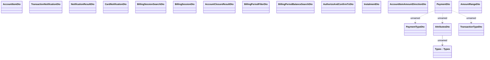

# Types

- **Diagram Type**: Logical
- **Package**: HomerSelect/BSL/Analysis Model/_Interface/Consumed services/Payment Card system/Account/Account Transactions/Types
- **Diagram ID**: 93148
- **Elements**: 18
- **Connectors**: 4

