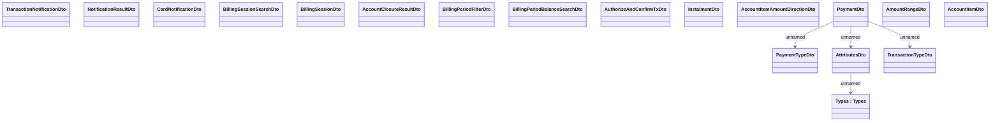

# Types

```mermaid
classDiagram
    class PaymentTypeDto["PaymentTypeDto"]
    class TransactionNotificationDto["TransactionNotificationDto"]
    class NotificationResultDto["NotificationResultDto"]
    class CardNotificationDto["CardNotificationDto"]
    class BillingSessionSearchDto["BillingSessionSearchDto"]
    class BillingSessionDto["BillingSessionDto"]
    class AccountClosureResultDto["AccountClosureResultDto"]
    class BillingPeriodFilterDto["BillingPeriodFilterDto"]
    class BillingPeriodBalanceSearchDto["BillingPeriodBalanceSearchDto"]
    class AuthorizeAndConfirmTxDto["AuthorizeAndConfirmTxDto"]
    class AttributesDto["AttributesDto"]
    class InstalmentDto["InstalmentDto"]
    class AccountItemAmountDirectionDto["AccountItemAmountDirectionDto"]
    class TransactionTypeDto["TransactionTypeDto"]
    class PaymentDto["PaymentDto"]
    class AmountRangeDto["AmountRangeDto"]
    class Types_Types["Types : Types"]
    class AccountItemDto["AccountItemDto"]
    PaymentDto --> TransactionTypeDto : unnamed
    PaymentDto --> AttributesDto : unnamed
    PaymentDto --> PaymentTypeDto : unnamed
    AttributesDto --> Types_Types : unnamed
```
