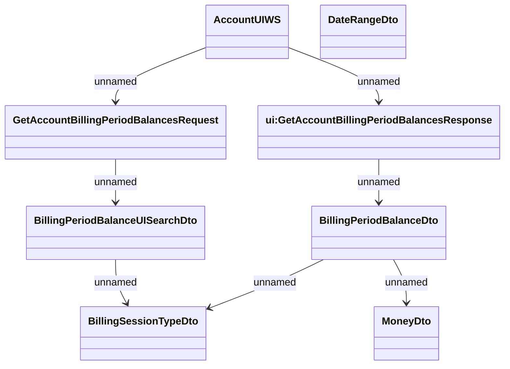

# Account UI - Interface diagram - Balances

```mermaid
classDiagram
    class BillingPeriodBalanceDto["BillingPeriodBalanceDto"]
    class BillingSessionTypeDto["BillingSessionTypeDto"]
    class AccountUIWS["AccountUIWS"]
    class MoneyDto["MoneyDto"]
    class BillingPeriodBalanceUISearchDto["BillingPeriodBalanceUISearchDto"]
    class ui_GetAccountBillingPeriodBalancesResponse["ui:GetAccountBillingPeriodBalancesResponse"]
    class GetAccountBillingPeriodBalancesRequest["GetAccountBillingPeriodBalancesRequest"]
    class DateRangeDto["DateRangeDto"]
    AccountUIWS --> GetAccountBillingPeriodBalancesRequest : unnamed
    AccountUIWS --> ui_GetAccountBillingPeriodBalancesResponse : unnamed
    GetAccountBillingPeriodBalancesRequest --> BillingPeriodBalanceUISearchDto : unnamed
    ui_GetAccountBillingPeriodBalancesResponse --> BillingPeriodBalanceDto : unnamed
    BillingPeriodBalanceDto --> BillingSessionTypeDto : unnamed
    BillingPeriodBalanceDto --> MoneyDto : unnamed
    BillingPeriodBalanceUISearchDto --> BillingSessionTypeDto : unnamed
```
