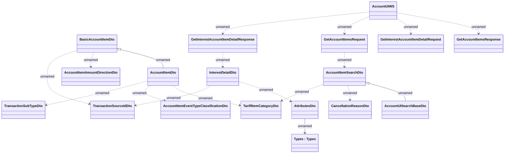

# Account UI - Interface diagram - Transactions

- **Diagram Type**: Logical
- **Package**: HomerSelect/BSL/Analysis Model/_Interface/Consumed services/Payment Card system/Account/Account UI
- **Diagram ID**: 67279
- **Elements**: 18
- **Connectors**: 18

