# Account UI - Interface diagram

- **Diagram Type**: Logical
- **Package**: HomerSelect/BSL/Analysis Model/_Interface/Consumed services/Payment Card system/Account/Account UI
- **Diagram ID**: 67277
- **Elements**: 13
- **Connectors**: 12

```mermaid
classDiagram
    class GetInterestAccountItemDetailResponse["GetInterestAccountItemDetailResponse"]
    class GetInterestAccountItemDetailRequest["GetInterestAccountItemDetailRequest"]
    class GetAccountItemsResponse["GetAccountItemsResponse"]
    class GetAccountItemsRequest["GetAccountItemsRequest"]
    class GetAccountListResponse["GetAccountListResponse"]
    class GetAccountListRequest["GetAccountListRequest"]
    class GetAccountResponse["GetAccountResponse"]
    class GetAccountRequest["GetAccountRequest"]
    class AccountUIWS["AccountUIWS"]
    class InstalmentPaymentMatchResponse["InstalmentPaymentMatchResponse"]
    class ui_GetAccountBillingPeriodBalancesResponse["ui:GetAccountBillingPeriodBalancesResponse"]
    class InstalmentPaymentMatchRequest["InstalmentPaymentMatchRequest"]
    class GetAccountBillingPeriodBalancesRequest["GetAccountBillingPeriodBalancesRequest"]
    AccountUIWS ..> GetAccountBillingPeriodBalancesRequest : unnamed
    AccountUIWS ..> InstalmentPaymentMatchRequest : unnamed
    AccountUIWS ..> ui_GetAccountBillingPeriodBalancesResponse : unnamed
    AccountUIWS ..> InstalmentPaymentMatchResponse : unnamed
    AccountUIWS ..> GetAccountRequest : unnamed
    AccountUIWS ..> GetAccountResponse : unnamed
    AccountUIWS ..> GetAccountListRequest : unnamed
    AccountUIWS ..> GetAccountListResponse : unnamed
    AccountUIWS ..> GetAccountItemsRequest : unnamed
    AccountUIWS ..> GetAccountItemsResponse : unnamed
    AccountUIWS ..> GetInterestAccountItemDetailRequest : unnamed
    AccountUIWS ..> GetInterestAccountItemDetailResponse : unnamed
```

