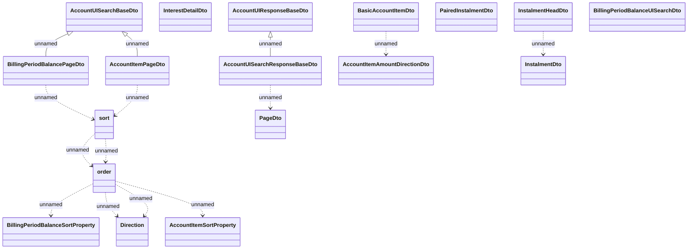

# Structures

- **Diagram Type**: Logical
- **Package**: HomerSelect/BSL/Analysis Model/_Interface/Consumed services/Payment Card system/Account/Account UI/Account UI - Structures
- **Diagram ID**: 107524
- **Elements**: 20
- **Connectors**: 14

