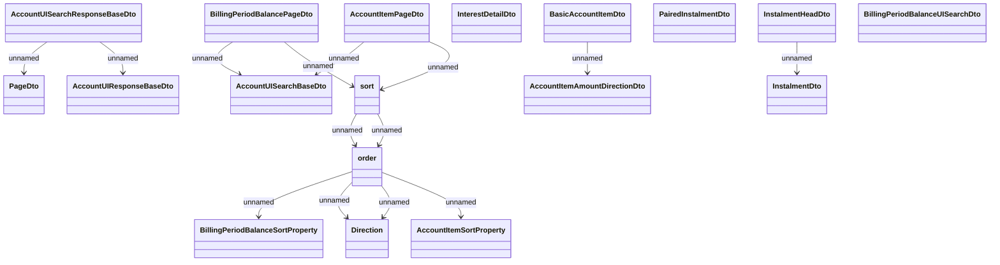

# Structures

```mermaid
classDiagram
    class order["order"]
    class sort["sort"]
    class AccountUISearchResponseBaseDto["AccountUISearchResponseBaseDto"]
    class AccountUIResponseBaseDto["AccountUIResponseBaseDto"]
    class AccountItemSortProperty["AccountItemSortProperty"]
    class PageDto["PageDto"]
    class Direction["Direction"]
    class BillingPeriodBalanceSortProperty["BillingPeriodBalanceSortProperty"]
    class order["order"]
    class sort["sort"]
    class BillingPeriodBalancePageDto["BillingPeriodBalancePageDto"]
    class AccountItemPageDto["AccountItemPageDto"]
    class AccountItemAmountDirectionDto["AccountItemAmountDirectionDto"]
    class InterestDetailDto["InterestDetailDto"]
    class BasicAccountItemDto["BasicAccountItemDto"]
    class AccountUISearchBaseDto["AccountUISearchBaseDto"]
    class PairedInstalmentDto["PairedInstalmentDto"]
    class InstalmentHeadDto["InstalmentHeadDto"]
    class InstalmentDto["InstalmentDto"]
    class BillingPeriodBalanceUISearchDto["BillingPeriodBalanceUISearchDto"]
    InstalmentHeadDto --> InstalmentDto : unnamed
    AccountItemPageDto --> AccountUISearchBaseDto : unnamed
    BillingPeriodBalancePageDto --> AccountUISearchBaseDto : unnamed
    BasicAccountItemDto --> AccountItemAmountDirectionDto : unnamed
    BillingPeriodBalancePageDto --> sort : unnamed
    sort --> order : unnamed
    order --> BillingPeriodBalanceSortProperty : unnamed
    order --> Direction : unnamed
    order --> Direction : unnamed
    AccountUISearchResponseBaseDto --> PageDto : unnamed
    order --> AccountItemSortProperty : unnamed
    AccountUISearchResponseBaseDto --> AccountUIResponseBaseDto : unnamed
    AccountItemPageDto --> sort : unnamed
    sort --> order : unnamed
```
