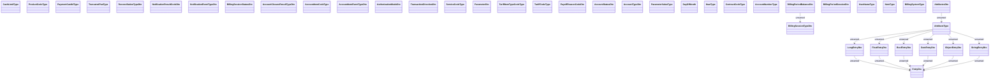

# COMMON (v2)

```mermaid
classDiagram
    class CashLimitType["CashLimitType"]
    class ProductCodeType["ProductCodeType"]
    class PaymentCardIdType["PaymentCardIdType"]
    class TruncatedPanType["TruncatedPanType"]
    class ReconciliationTypeDto["ReconciliationTypeDto"]
    class NotificationResultCodeDto["NotificationResultCodeDto"]
    class NotificationEventTypeDto["NotificationEventTypeDto"]
    class BillingSessionStatusDto["BillingSessionStatusDto"]
    class AccountClosureResultTypeDto["AccountClosureResultTypeDto"]
    class AccountItemCodeType["AccountItemCodeType"]
    class AccountItemEventTypeDto["AccountItemEventTypeDto"]
    class AuthorizationModeDto["AuthorizationModeDto"]
    class TransactionDirectionDto["TransactionDirectionDto"]
    class ServiceCodeType["ServiceCodeType"]
    class ParameterDto["ParameterDto"]
    class TariffItemTypeCodeType["TariffItemTypeCodeType"]
    class TariffCodeType["TariffCodeType"]
    class PayoffReasonCodeDto["PayoffReasonCodeDto"]
    class AccountStatusDto["AccountStatusDto"]
    class AccountTypeDto["AccountTypeDto"]
    class ParameterValueType["ParameterValueType"]
    class DayOfMonth["DayOfMonth"]
    class IbanType["IbanType"]
    class ContractCodeType["ContractCodeType"]
    class AccountNumberType["AccountNumberType"]
    class BillingPeriodBalanceDto["BillingPeriodBalanceDto"]
    class BillingPeriodSessionDto["BillingPeriodSessionDto"]
    class BillingSessionTypeDto["BillingSessionTypeDto"]
    class UserNameType["UserNameType"]
    class NoteType["NoteType"]
    class BillingSystemType["BillingSystemType"]
    class ObjectEntryDto["ObjectEntryDto"]
    class DateEntryDto["DateEntryDto"]
    class BoolEntryDto["BoolEntryDto"]
    class FloatEntryDto["FloatEntryDto"]
    class LongEntryDto["LongEntryDto"]
    class StringEntryDto["StringEntryDto"]
    class EntryDto["EntryDto"]
    class AttributeType["AttributeType"]
    class AttributesDto["AttributesDto"]
    AttributesDto --> AttributeType : unnamed
    LongEntryDto --> EntryDto : unnamed
    FloatEntryDto --> EntryDto : unnamed
    BoolEntryDto --> EntryDto : unnamed
    DateEntryDto --> EntryDto : unnamed
    ObjectEntryDto --> EntryDto : unnamed
    StringEntryDto --> EntryDto : unnamed
    AttributeType --> StringEntryDto : unnamed
    AttributeType --> LongEntryDto : unnamed
    AttributeType --> FloatEntryDto : unnamed
    AttributeType --> BoolEntryDto : unnamed
    AttributeType --> DateEntryDto : unnamed
    AttributeType --> ObjectEntryDto : unnamed
    BillingPeriodBalanceDto --> BillingSessionTypeDto : unnamed
```
