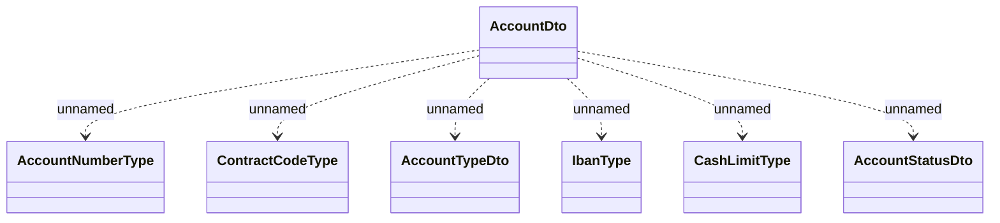

# COMMON (v6)

- **Diagram Type**: Logical
- **Package**: HomerSelect/BSL/Analysis Model/_Interface/Consumed services/Payment Card system/Account/COMMON for Account/COMMON (v6)
- **Diagram ID**: 141768
- **Elements**: 7
- **Connectors**: 6

