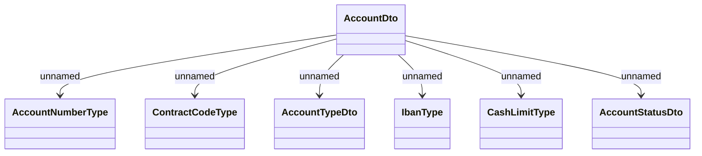

# COMMON (v6)

```mermaid
classDiagram
    class AccountStatusDto["AccountStatusDto"]
    class CashLimitType["CashLimitType"]
    class IbanType["IbanType"]
    class AccountTypeDto["AccountTypeDto"]
    class ContractCodeType["ContractCodeType"]
    class AccountDto["AccountDto"]
    class AccountNumberType["AccountNumberType"]
    AccountDto --> AccountNumberType : unnamed
    AccountDto --> ContractCodeType : unnamed
    AccountDto --> AccountTypeDto : unnamed
    AccountDto --> IbanType : unnamed
    AccountDto --> CashLimitType : unnamed
    AccountDto --> AccountStatusDto : unnamed
```
