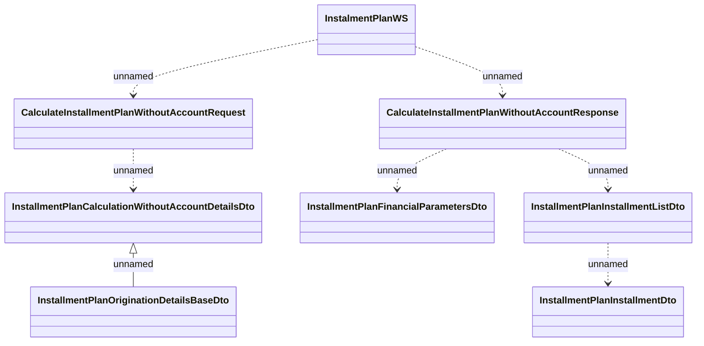

# CalculateInstallmentPlanWithoutAccount

- **Diagram Type**: Logical
- **Package**: HomerSelect/BSL/Analysis Model/_Interface/Consumed services/Payment Card system/Account/InstallmentPlanWS/CalculateInstallmentPlanWithoutAccount
- **Diagram ID**: 101232
- **Elements**: 8
- **Connectors**: 7

