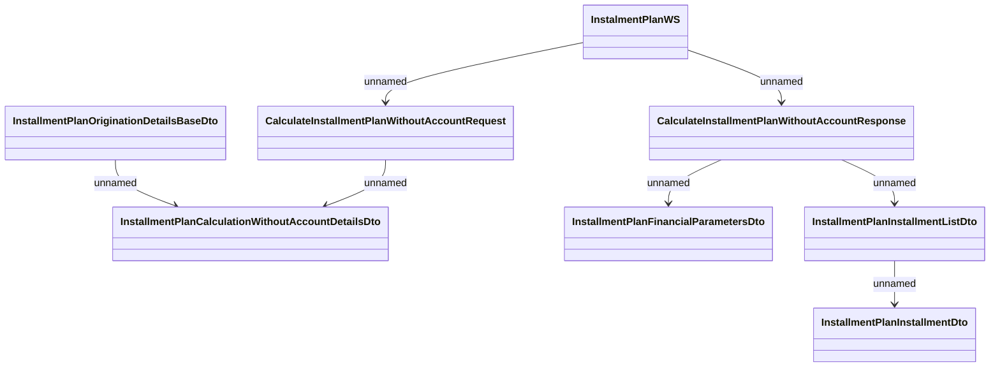

# CalculateInstallmentPlanWithoutAccount

```mermaid
classDiagram
    class InstallmentPlanFinancialParametersDto["InstallmentPlanFinancialParametersDto"]
    class InstallmentPlanOriginationDetailsBaseDto["InstallmentPlanOriginationDetailsBaseDto"]
    class InstallmentPlanCalculationWithoutAccountDetailsDto["InstallmentPlanCalculationWithoutAccountDetailsDto"]
    class InstallmentPlanInstallmentDto["InstallmentPlanInstallmentDto"]
    class InstallmentPlanInstallmentListDto["InstallmentPlanInstallmentListDto"]
    class CalculateInstallmentPlanWithoutAccountResponse["CalculateInstallmentPlanWithoutAccountResponse"]
    class CalculateInstallmentPlanWithoutAccountRequest["CalculateInstallmentPlanWithoutAccountRequest"]
    class InstalmentPlanWS["InstalmentPlanWS"]
    CalculateInstallmentPlanWithoutAccountResponse --> InstallmentPlanFinancialParametersDto : unnamed
    CalculateInstallmentPlanWithoutAccountRequest --> InstallmentPlanCalculationWithoutAccountDetailsDto : unnamed
    InstalmentPlanWS --> CalculateInstallmentPlanWithoutAccountRequest : unnamed
    InstalmentPlanWS --> CalculateInstallmentPlanWithoutAccountResponse : unnamed
    CalculateInstallmentPlanWithoutAccountResponse --> InstallmentPlanInstallmentListDto : unnamed
    InstallmentPlanOriginationDetailsBaseDto --> InstallmentPlanCalculationWithoutAccountDetailsDto : unnamed
    InstallmentPlanInstallmentListDto --> InstallmentPlanInstallmentDto : unnamed
```
