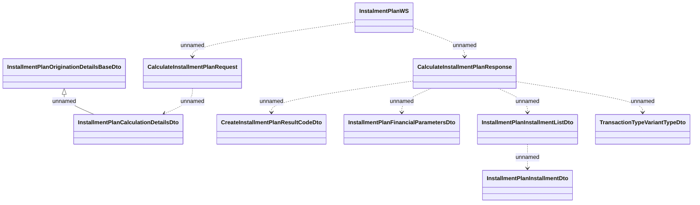

# CalculateInstalmentPlan

- **Diagram Type**: Logical
- **Package**: HomerSelect/BSL/Analysis Model/_Interface/Consumed services/Payment Card system/Account/InstallmentPlanWS/CalculateInstalmentPlan
- **Diagram ID**: 152255
- **Elements**: 10
- **Connectors**: 9

