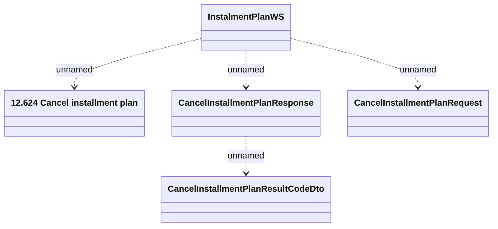

# CancelInstalmentPlan

- **Diagram Type**: Logical
- **Package**: HomerSelect/BSL/Analysis Model/_Interface/Consumed services/Payment Card system/Account/InstallmentPlanWS/CancelInstalmentPlan
- **Diagram ID**: 75617
- **Elements**: 5
- **Connectors**: 4

