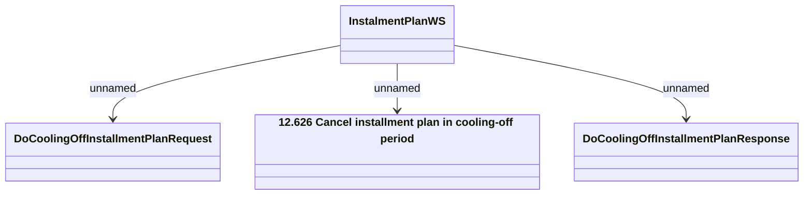

# DoCoolingOffInstalmentPlan

```mermaid
classDiagram
    class n_12_626_Cancel_installment_plan_in_cooling_off_period["12.626 Cancel installment plan in cooling-off period"]
    class DoCoolingOffInstallmentPlanResponse["DoCoolingOffInstallmentPlanResponse"]
    class DoCoolingOffInstallmentPlanRequest["DoCoolingOffInstallmentPlanRequest"]
    class InstalmentPlanWS["InstalmentPlanWS"]
    InstalmentPlanWS --> DoCoolingOffInstallmentPlanRequest : unnamed
    InstalmentPlanWS --> n_12_626_Cancel_installment_plan_in_cooling_off_period : unnamed
    InstalmentPlanWS --> DoCoolingOffInstallmentPlanResponse : unnamed
```
