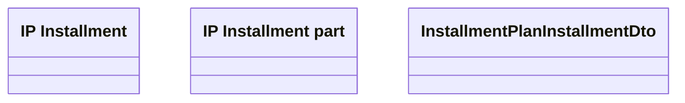

# GetInstalmentPlan - Mapping

- **Diagram Type**: Logical
- **Package**: HomerSelect/BSL/Analysis Model/_Interface/Consumed services/Payment Card system/Account/InstallmentPlanWS/GetInstalmentPlan
- **Diagram ID**: 67496
- **Elements**: 3
- **Connectors**: 0

