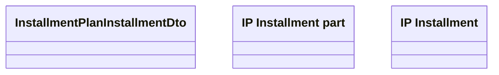

# GetInstalmentPlan - Mapping

```mermaid
classDiagram
    class InstallmentPlanInstallmentDto["InstallmentPlanInstallmentDto"]
    class IP_Installment_part["IP Installment part"]
    class IP_Installment["IP Installment"]
```
