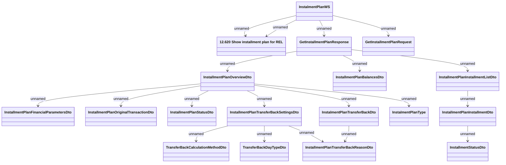

# GetInstalmentPlan

```mermaid
classDiagram
    class InstallmentStatusDto["InstallmentStatusDto"]
    class InstallmentPlanFinancialParametersDto["InstallmentPlanFinancialParametersDto"]
    class InstallmentPlanOriginalTransactionDto["InstallmentPlanOriginalTransactionDto"]
    class InstallmentPlanStatusDto["InstallmentPlanStatusDto"]
    class n_12_620_Show_installment_plan_for_REL["12.620 Show installment plan for REL"]
    class InstallmentPlanTransferBackReasonDto["InstallmentPlanTransferBackReasonDto"]
    class TransferBackDayTypeDto["TransferBackDayTypeDto"]
    class TransferBackCalculationMethodDto["TransferBackCalculationMethodDto"]
    class InstallmentPlanTransferBackSettingsDto["InstallmentPlanTransferBackSettingsDto"]
    class InstalmentPlanTransferBackDto["InstalmentPlanTransferBackDto"]
    class InstalmentPlanType["InstalmentPlanType"]
    class InstallmentPlanOverviewDto["InstallmentPlanOverviewDto"]
    class InstallmentPlanBalancesDto["InstallmentPlanBalancesDto"]
    class InstallmentPlanInstallmentDto["InstallmentPlanInstallmentDto"]
    class InstallmentPlanInstallmentListDto["InstallmentPlanInstallmentListDto"]
    class GetInstallmentPlanResponse["GetInstallmentPlanResponse"]
    class GetInstallmentPlanRequest["GetInstallmentPlanRequest"]
    class InstalmentPlanWS["InstalmentPlanWS"]
    GetInstallmentPlanResponse --> InstallmentPlanOverviewDto : unnamed
    GetInstallmentPlanResponse --> InstallmentPlanBalancesDto : unnamed
    GetInstallmentPlanResponse --> InstallmentPlanInstallmentListDto : unnamed
    InstallmentPlanInstallmentDto --> InstallmentStatusDto : unnamed
    InstallmentPlanInstallmentListDto --> InstallmentPlanInstallmentDto : unnamed
    InstallmentPlanTransferBackSettingsDto --> TransferBackCalculationMethodDto : unnamed
    InstallmentPlanTransferBackSettingsDto --> TransferBackDayTypeDto : unnamed
    InstallmentPlanTransferBackSettingsDto --> InstallmentPlanTransferBackReasonDto : unnamed
    InstallmentPlanOverviewDto --> InstallmentPlanTransferBackSettingsDto : unnamed
    InstallmentPlanOverviewDto --> InstallmentPlanOriginalTransactionDto : unnamed
    InstalmentPlanTransferBackDto --> InstallmentPlanTransferBackReasonDto : unnamed
    InstallmentPlanOverviewDto --> InstalmentPlanTransferBackDto : unnamed
    InstallmentPlanOverviewDto --> InstalmentPlanType : unnamed
    InstallmentPlanOverviewDto --> InstallmentPlanFinancialParametersDto : unnamed
    InstallmentPlanOverviewDto --> InstallmentPlanStatusDto : unnamed
    InstalmentPlanWS --> GetInstallmentPlanRequest : unnamed
    InstalmentPlanWS --> n_12_620_Show_installment_plan_for_REL : unnamed
    InstalmentPlanWS --> n_12_620_Show_installment_plan_for_REL : unnamed
    InstalmentPlanWS --> GetInstallmentPlanResponse : unnamed
```
