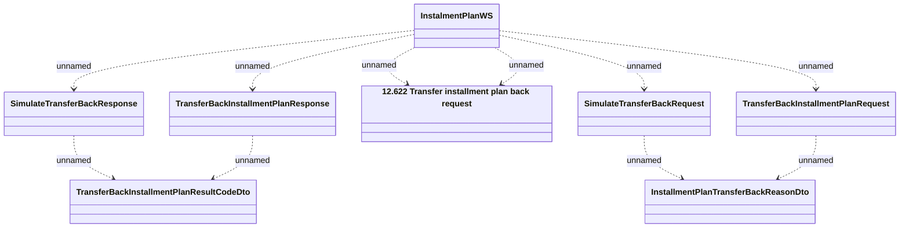

# TransferBackInstallmentPlan

- **Diagram Type**: Logical
- **Package**: HomerSelect/BSL/Analysis Model/_Interface/Consumed services/Payment Card system/Account/InstallmentPlanWS/TransferBackInstallmentPlan
- **Diagram ID**: 66769
- **Elements**: 8
- **Connectors**: 10

