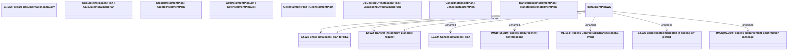

# InstallmentPlanWS

```mermaid
classDiagram
    class n_01_182_Prepare_documentation_manually["01.182 Prepare documentation manually"]
    class n_01_184_Process_ContractSignTransactionsSE_event["01.184 Process ContractSignTransactionsSE event"]
    class MOD_05_350_Process_disbursement_confirmation_message["{MOD}05.350 Process disbursement confirmation message"]
    class MOD_05_310_Process_disbursement_confirmations["{MOD}05.310 Process disbursement confirmations"]
    class CalculateInstalmentPlan_CalculateInstalmentPlan["CalculateInstalmentPlan : CalculateInstalmentPlan"]
    class CreateInstalmentPlan_CreateInstalmentPlan["CreateInstalmentPlan : CreateInstalmentPlan"]
    class GetInstalmentPlanList_GetInstalmentPlanList["GetInstalmentPlanList : GetInstalmentPlanList"]
    class GetInstalmentPlan_GetInstalmentPlan["GetInstalmentPlan : GetInstalmentPlan"]
    class DoCoolingOffInstalmentPlan_DoCoolingOffInstalmentPlan["DoCoolingOffInstalmentPlan : DoCoolingOffInstalmentPlan"]
    class CancelInstalmentPlan_CancelInstalmentPlan["CancelInstalmentPlan : CancelInstalmentPlan"]
    class TransferBackInstallmentPlan_TransferBackInstallmentPlan["TransferBackInstallmentPlan : TransferBackInstallmentPlan"]
    class n_12_624_Cancel_installment_plan["12.624 Cancel installment plan"]
    class n_12_622_Transfer_installment_plan_back_request["12.622 Transfer installment plan back request"]
    class n_12_626_Cancel_installment_plan_in_cooling_off_period["12.626 Cancel installment plan in cooling-off period"]
    class n_12_620_Show_installment_plan_for_REL["12.620 Show installment plan for REL"]
    class InstalmentPlanWS["InstalmentPlanWS"]
    InstalmentPlanWS --> n_12_620_Show_installment_plan_for_REL : unnamed
    InstalmentPlanWS --> n_12_620_Show_installment_plan_for_REL : unnamed
    InstalmentPlanWS --> n_12_622_Transfer_installment_plan_back_request : unnamed
    InstalmentPlanWS --> n_12_624_Cancel_installment_plan : unnamed
    InstalmentPlanWS --> MOD_05_310_Process_disbursement_confirmations : unnamed
    InstalmentPlanWS --> n_12_622_Transfer_installment_plan_back_request : unnamed
    InstalmentPlanWS --> n_01_184_Process_ContractSignTransactionsSE_event : unnamed
    InstalmentPlanWS --> n_12_626_Cancel_installment_plan_in_cooling_off_period : unnamed
    InstalmentPlanWS --> MOD_05_350_Process_disbursement_confirmation_message : unnamed
```
