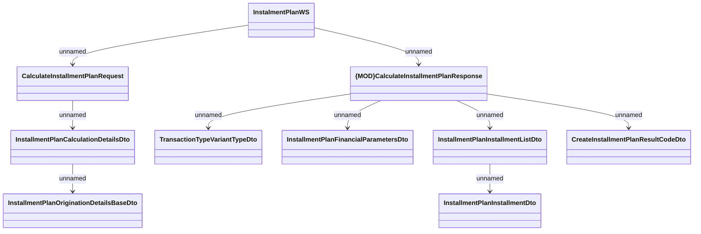

# CalculateInstalmentPlan

```mermaid
classDiagram
    class TransactionTypeVariantTypeDto["TransactionTypeVariantTypeDto"]
    class CreateInstallmentPlanResultCodeDto["CreateInstallmentPlanResultCodeDto"]
    class InstallmentPlanFinancialParametersDto["InstallmentPlanFinancialParametersDto"]
    class InstallmentPlanOriginationDetailsBaseDto["InstallmentPlanOriginationDetailsBaseDto"]
    class InstallmentPlanCalculationDetailsDto["InstallmentPlanCalculationDetailsDto"]
    class InstallmentPlanInstallmentDto["InstallmentPlanInstallmentDto"]
    class InstallmentPlanInstallmentListDto["InstallmentPlanInstallmentListDto"]
    class MOD_CalculateInstallmentPlanResponse["{MOD}CalculateInstallmentPlanResponse"]
    class CalculateInstallmentPlanRequest["CalculateInstallmentPlanRequest"]
    class InstalmentPlanWS["InstalmentPlanWS"]
    InstalmentPlanWS --> CalculateInstallmentPlanRequest : unnamed
    InstalmentPlanWS --> MOD_CalculateInstallmentPlanResponse : unnamed
    CalculateInstallmentPlanRequest --> InstallmentPlanCalculationDetailsDto : unnamed
    MOD_CalculateInstallmentPlanResponse --> TransactionTypeVariantTypeDto : unnamed
    MOD_CalculateInstallmentPlanResponse --> InstallmentPlanFinancialParametersDto : unnamed
    MOD_CalculateInstallmentPlanResponse --> InstallmentPlanInstallmentListDto : unnamed
    MOD_CalculateInstallmentPlanResponse --> CreateInstallmentPlanResultCodeDto : unnamed
    InstallmentPlanInstallmentListDto --> InstallmentPlanInstallmentDto : unnamed
    InstallmentPlanCalculationDetailsDto --> InstallmentPlanOriginationDetailsBaseDto : unnamed
```
