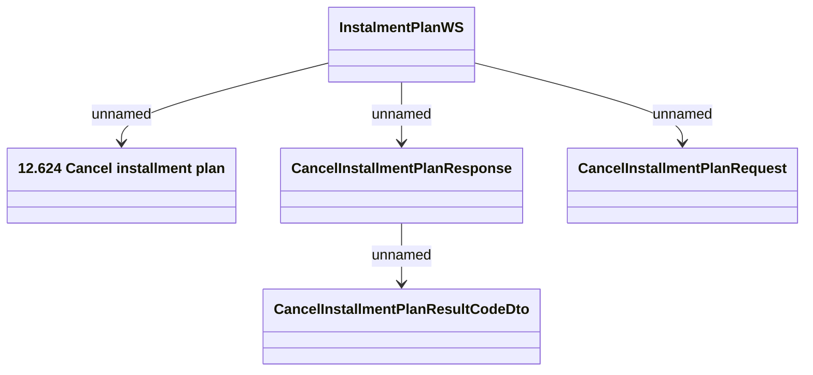

# CancelInstalmentPlan

```mermaid
classDiagram
    class CancelInstallmentPlanResultCodeDto["CancelInstallmentPlanResultCodeDto"]
    class n_12_624_Cancel_installment_plan["12.624 Cancel installment plan"]
    class CancelInstallmentPlanResponse["CancelInstallmentPlanResponse"]
    class CancelInstallmentPlanRequest["CancelInstallmentPlanRequest"]
    class InstalmentPlanWS["InstalmentPlanWS"]
    InstalmentPlanWS --> CancelInstallmentPlanResponse : unnamed
    InstalmentPlanWS --> CancelInstallmentPlanRequest : unnamed
    InstalmentPlanWS --> n_12_624_Cancel_installment_plan : unnamed
    CancelInstallmentPlanResponse --> CancelInstallmentPlanResultCodeDto : unnamed
```
