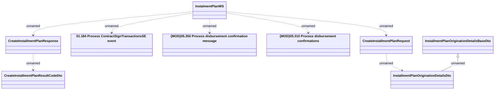

# CreateInstalmentPlan

- **Diagram Type**: Logical
- **Package**: HomerSelect/BSL/Analysis Model/_Interface/Consumed services/Payment Card system/Account/InstallmentPlanWS_v5/CreateInstalmentPlan
- **Diagram ID**: 99843
- **Elements**: 9
- **Connectors**: 8

