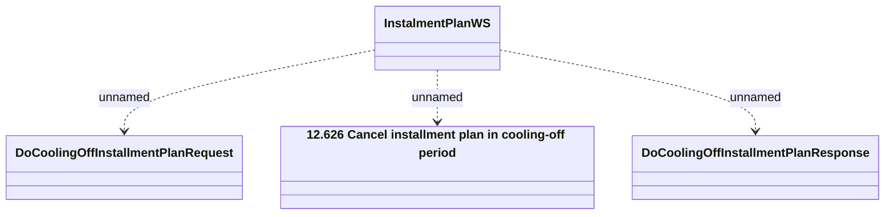

# DoCoolingOffInstalmentPlan

- **Diagram Type**: Logical
- **Package**: HomerSelect/BSL/Analysis Model/_Interface/Consumed services/Payment Card system/Account/InstallmentPlanWS_v5/DoCoolingOffInstalmentPlan
- **Diagram ID**: 99837
- **Elements**: 4
- **Connectors**: 3

