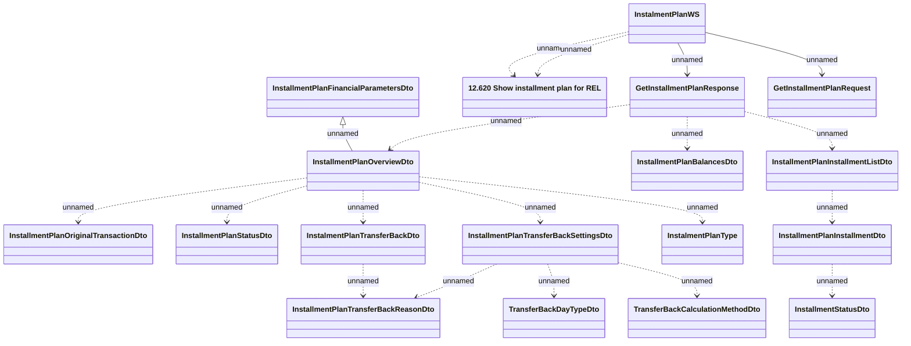

# GetInstalmentPlan

- **Diagram Type**: Logical
- **Package**: HomerSelect/BSL/Analysis Model/_Interface/Consumed services/Payment Card system/Account/InstallmentPlanWS_v5/GetInstalmentPlan
- **Diagram ID**: 99838
- **Elements**: 18
- **Connectors**: 19

