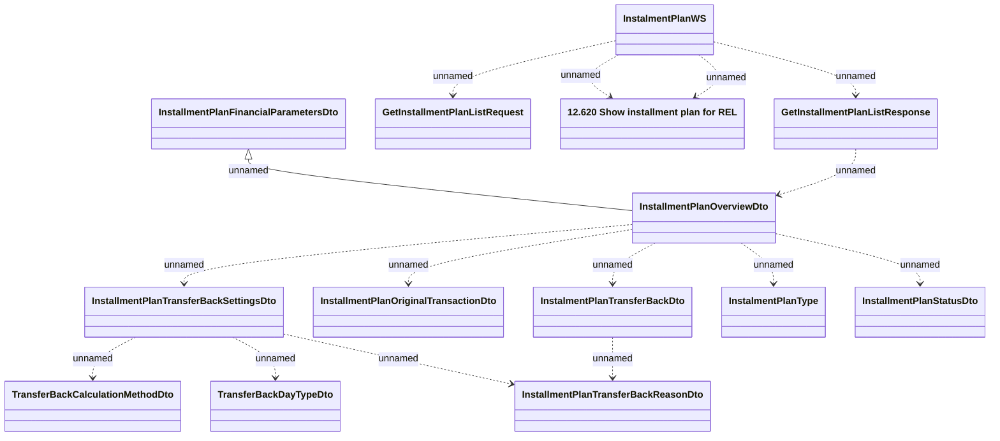

# GetInstalmentPlanList

- **Diagram Type**: Logical
- **Package**: HomerSelect/BSL/Analysis Model/_Interface/Consumed services/Payment Card system/Account/InstallmentPlanWS_v5/GetInstalmentPlanList
- **Diagram ID**: 99840
- **Elements**: 14
- **Connectors**: 15

