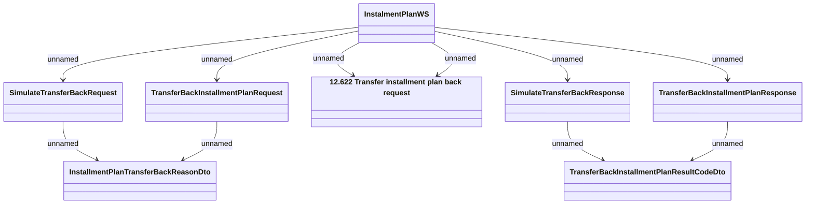

# TransferBackInstallmentPlan

```mermaid
classDiagram
    class TransferBackInstallmentPlanResultCodeDto["TransferBackInstallmentPlanResultCodeDto"]
    class TransferBackInstallmentPlanResponse["TransferBackInstallmentPlanResponse"]
    class TransferBackInstallmentPlanRequest["TransferBackInstallmentPlanRequest"]
    class n_12_622_Transfer_installment_plan_back_request["12.622 Transfer installment plan back request"]
    class InstallmentPlanTransferBackReasonDto["InstallmentPlanTransferBackReasonDto"]
    class SimulateTransferBackResponse["SimulateTransferBackResponse"]
    class SimulateTransferBackRequest["SimulateTransferBackRequest"]
    class InstalmentPlanWS["InstalmentPlanWS"]
    InstalmentPlanWS --> n_12_622_Transfer_installment_plan_back_request : unnamed
    InstalmentPlanWS --> SimulateTransferBackRequest : unnamed
    InstalmentPlanWS --> n_12_622_Transfer_installment_plan_back_request : unnamed
    InstalmentPlanWS --> TransferBackInstallmentPlanRequest : unnamed
    SimulateTransferBackRequest --> InstallmentPlanTransferBackReasonDto : unnamed
    SimulateTransferBackResponse --> TransferBackInstallmentPlanResultCodeDto : unnamed
    TransferBackInstallmentPlanRequest --> InstallmentPlanTransferBackReasonDto : unnamed
    TransferBackInstallmentPlanResponse --> TransferBackInstallmentPlanResultCodeDto : unnamed
    InstalmentPlanWS --> SimulateTransferBackResponse : unnamed
    InstalmentPlanWS --> TransferBackInstallmentPlanResponse : unnamed
```
