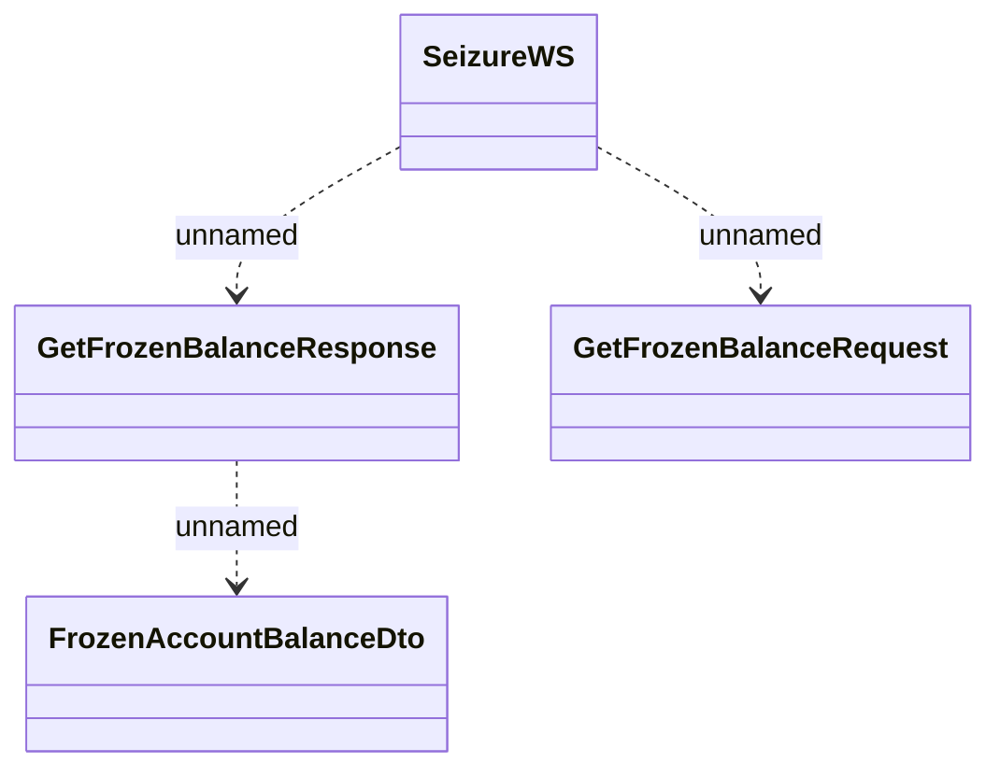

# SeizureWS - GetFrozenBalance

- **Diagram Type**: Logical
- **Package**: HomerSelect/BSL/Analysis Model/_Interface/Consumed services/Payment Card system/Account/SeizureWS
- **Diagram ID**: 76409
- **Elements**: 4
- **Connectors**: 3

