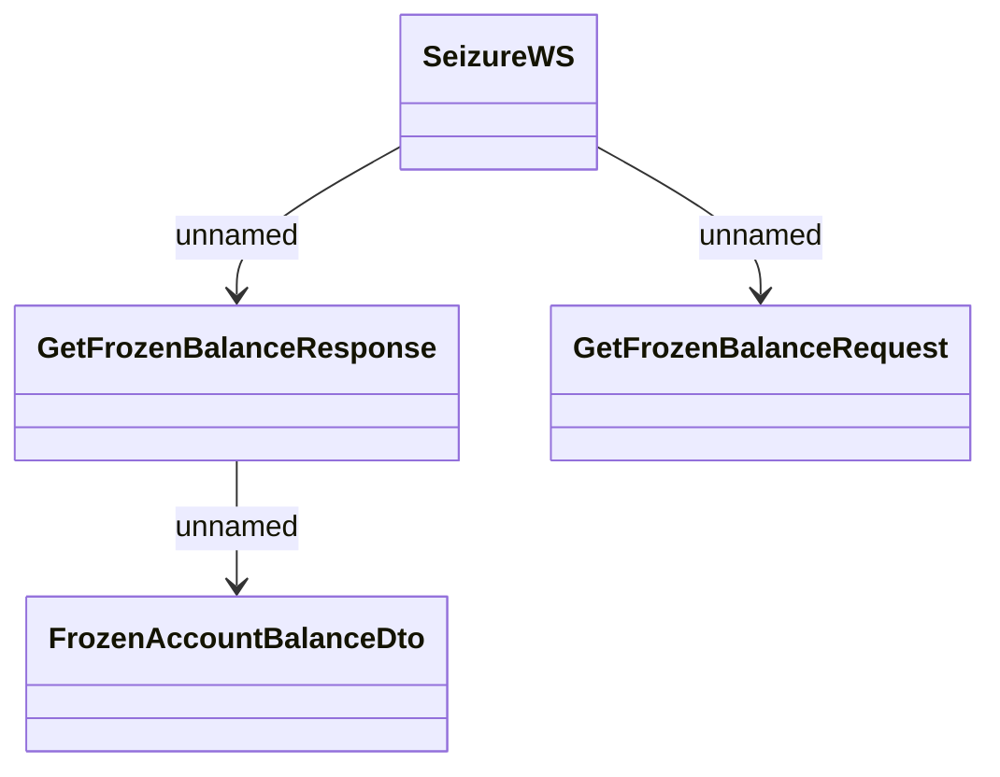

# SeizureWS - GetFrozenBalance

```mermaid
classDiagram
    class FrozenAccountBalanceDto["FrozenAccountBalanceDto"]
    class GetFrozenBalanceResponse["GetFrozenBalanceResponse"]
    class GetFrozenBalanceRequest["GetFrozenBalanceRequest"]
    class SeizureWS["SeizureWS"]
    SeizureWS --> GetFrozenBalanceRequest : unnamed
    SeizureWS --> GetFrozenBalanceResponse : unnamed
    GetFrozenBalanceResponse --> FrozenAccountBalanceDto : unnamed
```
