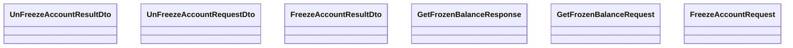

# Messages

- **Diagram Type**: Logical
- **Package**: HomerSelect/BSL/Analysis Model/_Interface/Consumed services/Payment Card system/Account/SeizureWS/Messages
- **Diagram ID**: 76412
- **Elements**: 6
- **Connectors**: 0

