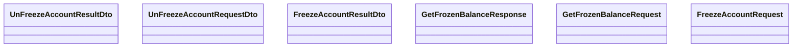

# Messages

```mermaid
classDiagram
    class UnFreezeAccountResultDto["UnFreezeAccountResultDto"]
    class UnFreezeAccountRequestDto["UnFreezeAccountRequestDto"]
    class FreezeAccountResultDto["FreezeAccountResultDto"]
    class GetFrozenBalanceResponse["GetFrozenBalanceResponse"]
    class GetFrozenBalanceRequest["GetFrozenBalanceRequest"]
    class FreezeAccountRequest["FreezeAccountRequest"]
```
