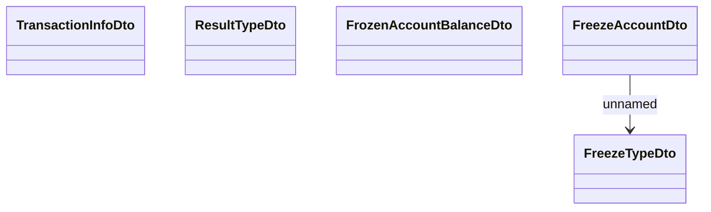

# Types

- **Diagram Type**: Logical
- **Package**: HomerSelect/BSL/Analysis Model/_Interface/Consumed services/Payment Card system/Account/SeizureWS/Types
- **Diagram ID**: 76413
- **Elements**: 5
- **Connectors**: 1

