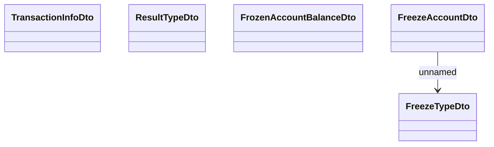

# Types

```mermaid
classDiagram
    class TransactionInfoDto["TransactionInfoDto"]
    class ResultTypeDto["ResultTypeDto"]
    class FreezeTypeDto["FreezeTypeDto"]
    class FrozenAccountBalanceDto["FrozenAccountBalanceDto"]
    class FreezeAccountDto["FreezeAccountDto"]
    FreezeAccountDto --> FreezeTypeDto : unnamed
```
