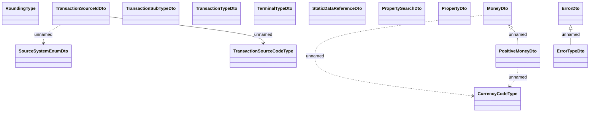

# COMMON for Cabus

- **Diagram Type**: Logical
- **Package**: HomerSelect/BSL/Analysis Model/_Interface/Consumed services/Payment Card system/COMMON for Cabus
- **Diagram ID**: 139540
- **Elements**: 15
- **Connectors**: 6

