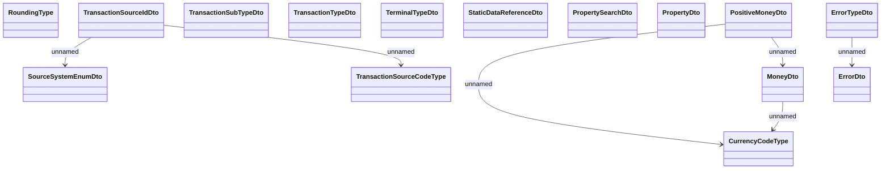

# COMMON for Cabus

```mermaid
classDiagram
    class RoundingType["RoundingType"]
    class TransactionSourceIdDto["TransactionSourceIdDto"]
    class TransactionSourceCodeType["TransactionSourceCodeType"]
    class SourceSystemEnumDto["SourceSystemEnumDto"]
    class TransactionSubTypeDto["TransactionSubTypeDto"]
    class TransactionTypeDto["TransactionTypeDto"]
    class TerminalTypeDto["TerminalTypeDto"]
    class StaticDataReferenceDto["StaticDataReferenceDto"]
    class PropertySearchDto["PropertySearchDto"]
    class PropertyDto["PropertyDto"]
    class PositiveMoneyDto["PositiveMoneyDto"]
    class MoneyDto["MoneyDto"]
    class CurrencyCodeType["CurrencyCodeType"]
    class ErrorDto["ErrorDto"]
    class ErrorTypeDto["ErrorTypeDto"]
    ErrorTypeDto --> ErrorDto : unnamed
    PositiveMoneyDto --> CurrencyCodeType : unnamed
    MoneyDto --> CurrencyCodeType : unnamed
    PositiveMoneyDto --> MoneyDto : unnamed
    TransactionSourceIdDto --> SourceSystemEnumDto : unnamed
    TransactionSourceIdDto --> TransactionSourceCodeType : unnamed
```
