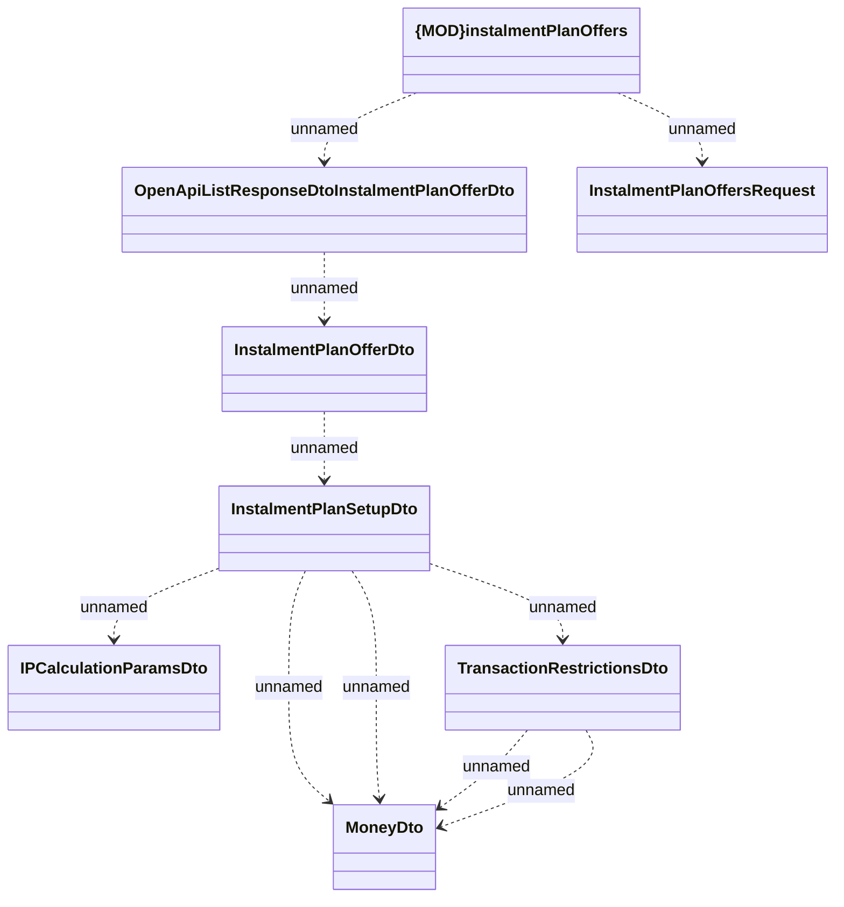

# Get instalmentPlanOffersV3

- **Diagram Type**: Logical
- **Package**: HomerSelect/BSL/Analysis Model/_Interface/Consumed services/Payment Card system/Cabus AM REST/Get instalmentPlanOffersV3
- **Diagram ID**: 124937
- **Elements**: 9
- **Connectors**: 10

