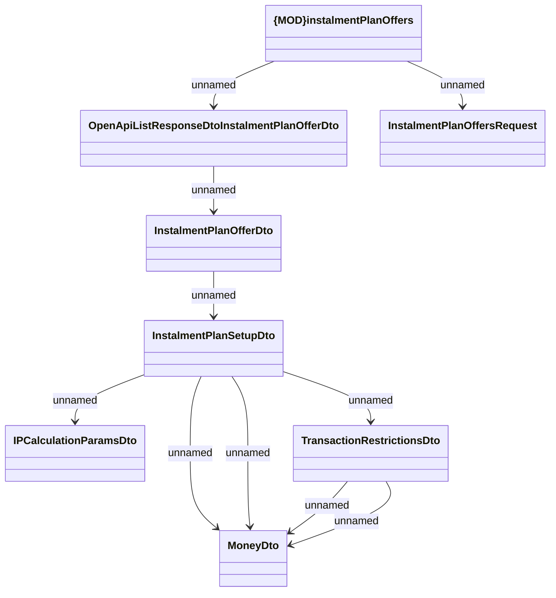

# Get instalmentPlanOffersV3

```mermaid
classDiagram
    class MoneyDto["MoneyDto"]
    class MOD_instalmentPlanOffers["{MOD}instalmentPlanOffers"]
    class IPCalculationParamsDto["IPCalculationParamsDto"]
    class TransactionRestrictionsDto["TransactionRestrictionsDto"]
    class InstalmentPlanSetupDto["InstalmentPlanSetupDto"]
    class InstalmentPlanOfferDto["InstalmentPlanOfferDto"]
    class OpenApiListResponseDtoInstalmentPlanOfferDto["OpenApiListResponseDtoInstalmentPlanOfferDto"]
    class InstalmentPlanOffersRequest["InstalmentPlanOffersRequest"]
    OpenApiListResponseDtoInstalmentPlanOfferDto --> InstalmentPlanOfferDto : unnamed
    InstalmentPlanOfferDto --> InstalmentPlanSetupDto : unnamed
    InstalmentPlanSetupDto --> IPCalculationParamsDto : unnamed
    InstalmentPlanSetupDto --> MoneyDto : unnamed
    InstalmentPlanSetupDto --> MoneyDto : unnamed
    InstalmentPlanSetupDto --> TransactionRestrictionsDto : unnamed
    TransactionRestrictionsDto --> MoneyDto : unnamed
    TransactionRestrictionsDto --> MoneyDto : unnamed
    MOD_instalmentPlanOffers --> OpenApiListResponseDtoInstalmentPlanOfferDto : unnamed
    MOD_instalmentPlanOffers --> InstalmentPlanOffersRequest : unnamed
```
