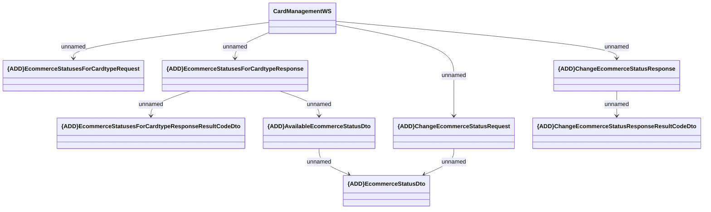

# Card Management - E-commerce

```mermaid
classDiagram
    class ADD_AvailableEcommerceStatusDto["{ADD}AvailableEcommerceStatusDto"]
    class ADD_EcommerceStatusDto["{ADD}EcommerceStatusDto"]
    class ADD_EcommerceStatusesForCardtypeResponseResultCodeDto["{ADD}EcommerceStatusesForCardtypeResponseResultCodeDto"]
    class ADD_ChangeEcommerceStatusResponseResultCodeDto["{ADD}ChangeEcommerceStatusResponseResultCodeDto"]
    class ADD_ChangeEcommerceStatusResponse["{ADD}ChangeEcommerceStatusResponse"]
    class ADD_ChangeEcommerceStatusRequest["{ADD}ChangeEcommerceStatusRequest"]
    class ADD_EcommerceStatusesForCardtypeResponse["{ADD}EcommerceStatusesForCardtypeResponse"]
    class ADD_EcommerceStatusesForCardtypeRequest["{ADD}EcommerceStatusesForCardtypeRequest"]
    class CardManagementWS["CardManagementWS"]
    CardManagementWS --> ADD_EcommerceStatusesForCardtypeRequest : unnamed
    CardManagementWS --> ADD_EcommerceStatusesForCardtypeResponse : unnamed
    CardManagementWS --> ADD_ChangeEcommerceStatusRequest : unnamed
    CardManagementWS --> ADD_ChangeEcommerceStatusResponse : unnamed
    ADD_ChangeEcommerceStatusResponse --> ADD_ChangeEcommerceStatusResponseResultCodeDto : unnamed
    ADD_EcommerceStatusesForCardtypeResponse --> ADD_EcommerceStatusesForCardtypeResponseResultCodeDto : unnamed
    ADD_ChangeEcommerceStatusRequest --> ADD_EcommerceStatusDto : unnamed
    ADD_EcommerceStatusesForCardtypeResponse --> ADD_AvailableEcommerceStatusDto : unnamed
    ADD_AvailableEcommerceStatusDto --> ADD_EcommerceStatusDto : unnamed
```
